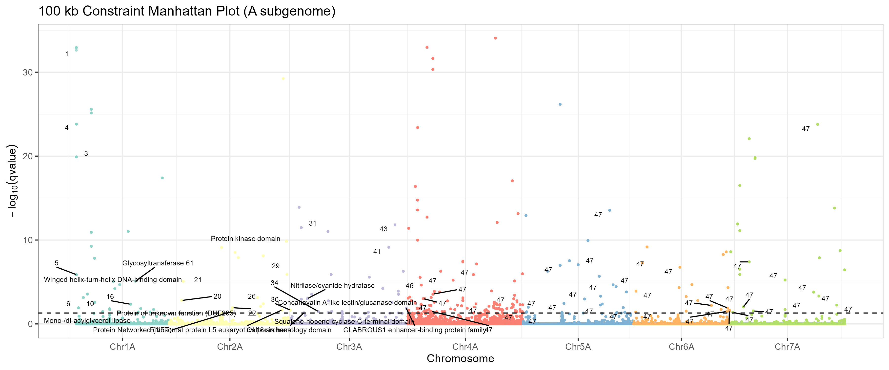
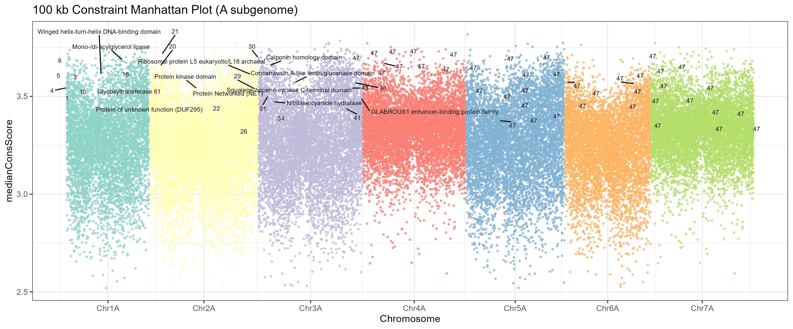
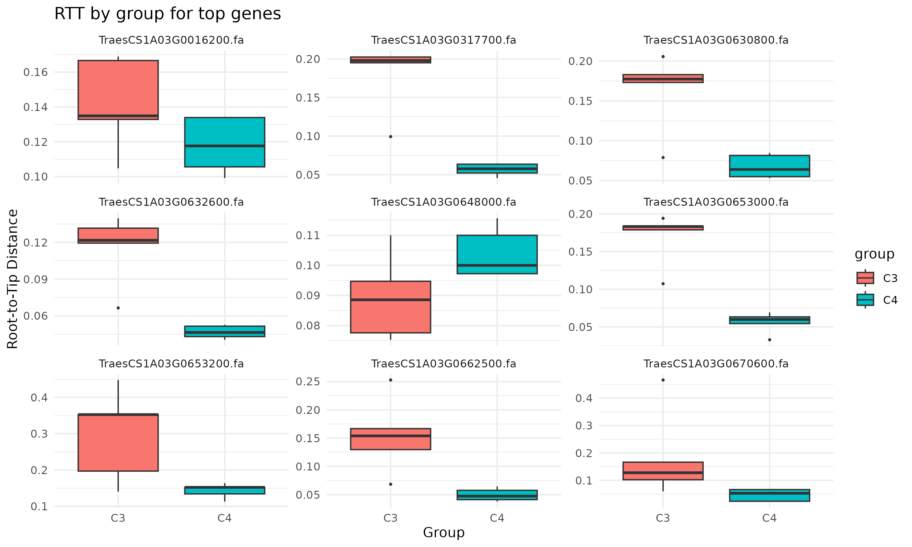
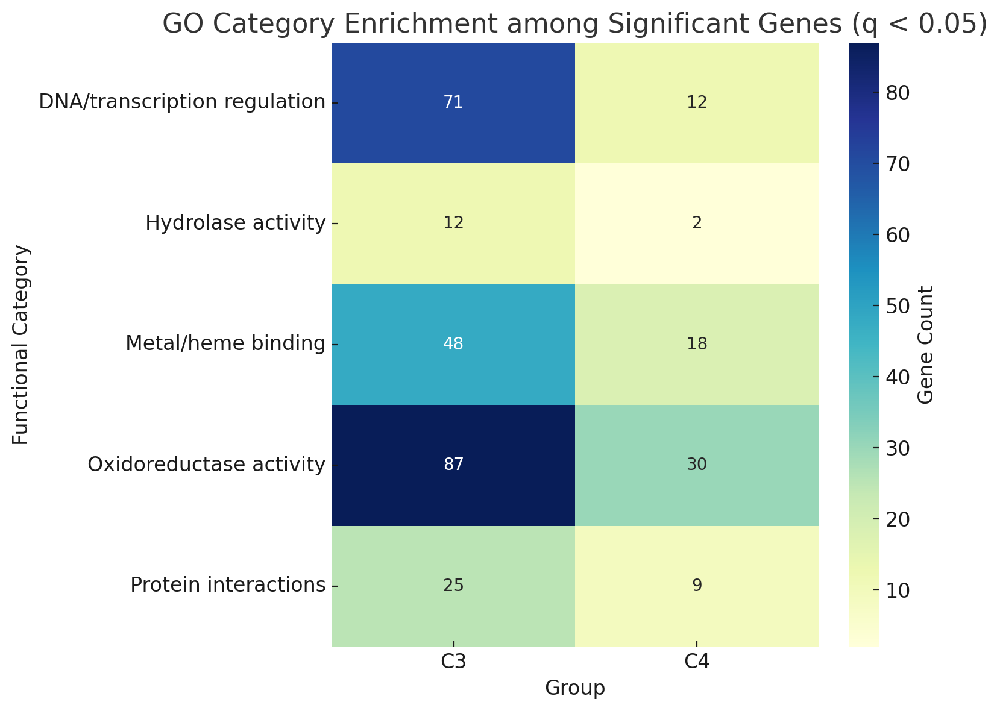

# Evolutionary constraint across the grass family (Poaceae)

## Background

The study of **conserved genomic elements** is a key direction in evolutionary biology. Genomic regions that have remained unchanged across millions of years often indicate essential biological functions. **Comparative genomics**, which involves comparing genomes across multiple species, provides a powerful framework to identify such regions under **purifying selection**, which eliminates deleterious mutations.

For example, the **Zoonomia Project**, a large-scale comparison of mammalian genomes, has demonstrated that this approach enables precise identification of conserved elements, including **non-coding regions**, that are likely to be functionally important. Identifying these constrained elements helps link genome structure to phenotype and function.

In the context of **grasses (Poaceae)** — and especially in species like **wheat (*Triticum aestivum*)** — this analysis is particularly relevant. The wheat genome is **large and TE-rich**, containing a vast number of **transposable elements (TEs)**. Despite this, there are **gene-rich regions** containing important loci, many of which have been under selection during domestication and breeding.

Studying conservation within these regions — and especially within **selective sweeps** — helps to:

- Understand **fundamental biological processes**,
- Reveal mechanisms of **adaptation** to different environmental and agricultural conditions,
- Identify genes responsible for key **agronomic traits**, such as:
  - **Brittle rachis** (shattering resistance),
  - **Free threshing** (grain harvestability).

Conservation of specific sequences in these functionally relevant regions, in contrast to rapidly evolving or highly repetitive regions, highlights their **critical role in plant biology** and crop improvement.


## Purpose

The purpose of this project is to explore evolutionary constraints and innovations across the grass family (Poaceae) using multispecies whole-genome alignments and phyloP conservation scores.

Students are provided with a reference-based multiple sequence alignment of 80 Poaceae genomes (reference: *Triticum aestivum*, bread wheat). The analysis is divided into the following goals:

- Identify regions of **conserved** and **accelerated** evolution across the genome using phyloP scores.
- Annotate conserved segments, most of which are expected to lie in **non-coding regions**.
- Investigate **gene-specific evolutionary rates** by comparing root-to-tip distances between species, and detect **clade-specific acceleration**, particularly between C₃ and C₄ lineages.
- Explore associations between evolutionary signals and **functional phenotypic traits**.

This is an exploratory project encouraging **independent hypothesis formulation** and **flexible workflows**. A high-performance server is available for conducting computationally intensive steps.

## Table of Contents

- [Description](##description)
- [Repository Structure](##repository-structure)
- [Results](##results)
- [Running the Analysis](##running-the-analysis)
- [Bibliography](##Bibliography)


## Description

This project includes two complementary analyses:

1. **Constraint analysis based on phyloP scores:**
   - Identifies 100kb genomic windows enriched for significantly conserved positions (phyloP q < 0.05).
   - Integrates annotations (CDS, exons, genes, TEs, ISBPs, GC content).
   - Produces Manhattan plots highlighting conserved and potentially regulatory regions.

2. **Root-to-tip evolutionary rate analysis (C3 vs C4):**
   - Constructs phylogenetic trees for each gene across species.
   - Compares root-to-tip distances between C3 and C4 species using Wilcoxon test.
   - Applies FDR correction to identify genes with significantly different rates.

---

## Repository Structure

### Results

#### Constraint Analysis

**Output table:** `results/merged_bindata.100000.tsv`

| Column               | Description                                                             |
|----------------------|-------------------------------------------------------------------------|
| `chr`, `start`, `end`| 100kb genomic window coordinates                                        |
| `totalBases`         | Positions with any phyloP score                                         |
| `conservedBases`     | Bases in conserved segments (from q < 0.05 + score > 2.5)               |
| `cds.distinct.sum`   | Total CDS coverage length                                               |
| `exon.distinct.sum`  | Total exon coverage length                                              |
| `gene.count`         | Number of overlapping genes                                             |
| `intergenic.length`  | Bases outside gene annotations                                          |
| `GC`                 | GC content of the window                                                |
| `TE.count`           | Overlaps with transposable elements                                     |
| `ISBP.count`         | Overlaps with ISBP-class TE elements                                    |
| `totalConservedBases`| Significantly conserved positions (q < 0.05 & phyloP > 2.5)             |
| `meanConsScore`      | Mean phyloP for significant bases                                       |
| `gene`               | Comma-separated list of gene IDs                                        |

Manhattan plots show outlier windows (q < 0.05).  
Some constrained windows lack annotated genes (№47, `gene = NA`), indicating possible conserved non-coding elements.





##### Plot Interpretation

| Plot                   | Description                                                                                      | Key Observations                                                                                           |
|------------------------|--------------------------------------------------------------------------------------------------|-------------------------------------------------------------------------------------------------------------|
| `-log10(q-value)`      | Statistical significance of deviation from model prediction (dashed line = q-value threshold 0.05) | Most constrained genes (q-value < 0.05) are located on chromosomes Chr1A–4A. Other significant windows (ID 47) may represent conserved non-coding regions. |
| `medianConsScore`      | Robust median of phyloP values per 100kb window (measures typical conservation level)            | Constraint is distributed in wide blocks. High phyloP score ≠ always low q-value. Top 10 constrained windows per chromosome are labeled. |

---

#### Evolutionary Analysis of Genes Associated with C₃/C₄ Photosynthesis


C₃ photosynthesis is the most common carbon fixation pathway, especially in temperate climates. It relies on the enzyme **RuBisCO**, which is prone to **photorespiration** under high temperatures or low CO₂ concentrations.

C₄ photosynthesis is an adaptation to **hot and dry environments**. It begins with the fixation of CO₂ into 4-carbon compounds in mesophyll cells. These compounds are transported to **bundle-sheath cells**, where CO₂ is released into a high-concentration zone for RuBisCO. This **reduces photorespiration** and increases efficiency.

##### Summary of Evolutionary Analysis

We analyzed evolutionary divergence between C₃ and C₄ species by calculating **root-to-tip distances (RTT)** in gene trees constructed from aligned sequences.  
Statistical comparison was performed using **Wilcoxon tests**, with **FDR correction** applied to obtain q-values.

**Results:**

- **220 genes** showed significant RTT divergence between C₃ and C₄ lineages (**q < 0.05**)
- **173 genes** had **longer RTT in C₃ species**  
  → Indicative of **faster evolution** in C₃ lineages
- **47 genes** had **longer RTT in C₄ species**  
  → Potentially **conserved** in C₄ lineages
- **No genes** showed opposite-direction significance

##### Functional Enrichment of C₃-Shifted Genes

C₃-associated genes (i.e., evolving faster in C₃) were significantly enriched for the following functions:

- **Oxidoreductase activity**  
  Involved in redox metabolism, key for photosynthetic electron transport
- **DNA binding and transcription regulation**  
  Includes transcription factors and DNA-interacting proteins
- **Iron and heme binding**  
  Important for cytochromes and electron transport components
- **Oxidation–reduction processes**  
  General redox-related cellular pathways
- **Protein interactions**  
  Involved in signal transduction and complex formation
- **Hydrolase activity**  
  Enzymes that hydrolyze chemical bonds

These categories reflect core **photosynthetic and regulatory functions**. Their **evolutionary constraint in C₄ species** may result from the compartmentalized and efficient operation of photosynthesis under **arid and high-light** conditions.


**GO enrichment** for C3-shifted genes highlights biological categories such as:

- Oxidoreductase activity  
- DNA binding  
- Transcription factor activity  
- Heme/iron ion binding





##### Biological Interpretation

- **Genes with longer RTT in C₄** species may represent **adaptations** that evolved under **increased constraint** to maintain optimized function.
- **Genes with longer RTT in C₃** species likely underwent **relaxed selection** or **adaptive divergence** in C₃ lineages.

---

### Running the Analysis

#### Environment Setup

Python

R packages

#### Constraint Analysis Run

##### 1. Process phyloP data

```bash
python scripts/process_phyloP_paral.py data/roast.maf
```
This script processes phyloP scores from a MAF file and applies FDR correction to identify significantly conserved positions (q < 0.05)

##### 2. Define conserved regions

```bash
python scripts/find_conserved_multi.py
```
Merges adjacent significant positions into conserved segments. Output: {CHR}_conserved_segments.bed.

##### 3. Generate 100kb bins with annotations

```bash
bash scripts/generate_bindata.sh
```
This script:

- Creates 100kb windows using `bedtools makewindows`
- Computes the following features per bin:
  - Total number of bases with phyloP scores
  - Number of conserved positions
  - Length of overlapping CDS and exons
  - Gene count
  - Intergenic length
  - GC content (via `bedtools nuc`)
  - Number of overlaps with TE and ISBP elements
  - Mean phyloP score for significant bases
  - List of overlapping gene names

**Output:** `merged_bindata.100000.tsv`


##### 4. Identify constrained windows

```bash
Rscript scripts/100kb_bin_constraint.R
```
Fits a linear regression model to predict the expected number of conserved bases in each window, then computes standardized residuals, p-values, and q-values. Windows with q < 0.05 are considered significantly constrained. A Manhattan plot is generated to visualize results.

#### C3/C4 Root-to-Tip Analysis

##### 1. Prepare per-gene alignments

Use gene coordinates and the MAF file to extract one alignment per gene. Convert each MAF block into FASTA format using

```bash
mafToFastaStitcher input.gene.maf > gene.fasta
```
Ensure that species identifiers match between alignment files and the tree.

##### 2. Run evolutionary rate comparison

```bash
Rscript scripts/run_C3_C4.R | tee run_C3_C4.log
```
This script:

Builds gene trees using the JC69 model  
Computes root-to-tip (RTT) distances per species  
Compares RTT between C3 and C4 species using the Wilcoxon test  
Applies FDR correction to identify significantly shifted genes  

**Outputs:**

- `genes_C3.txt`: genes evolving faster in C3 lineages  
- `genes_C4.txt`: genes evolving faster in C4 lineages  
- `root_to_tip_C3vsC4.csv`: full table with RTT values, p-values, q-values 

#### miRNA Target Analysis Pipeline  

This pipeline identifies and analyzes miRNA targets in conserved genomic regions of *Triticum aestivum* (bread wheat), with functional annotation via GO term analysis.  

##### Pipeline Overview  

1. Convert conserved regions (TSV) to BED format with 500bp flanking regions
2. Extract genomic sequences in FASTA format
3. Identify miRNA targets using psRNATarget
4. Filter miRNA-target pairs by binding strength
5. Perform GO term enrichment analysis

##### Requirements  

- Conda (Miniconda or Anaconda)
- Unix-like environment (Linux/macOS)
- Web browser for online tools

##### Installation  

```bash
conda env create -f env.yaml
conda activate mirna_analysis
```

##### Usage  

1. Prepare Genomic Regions  
Convert TSV to BED format with 500bp flanking regions:  

```bash
awk -v OFS='\t' 'NR > 1 {start = ($2 - 500 < 0) ? 0 : $2 - 500; print $1, start, $3 + 500, $4, $5}' input.tsv > regions_with_window.bed
```

2. Extract Sequences  
Extract FASTA sequences using your preferred tool (e.g., bedtools):  

```bash
bedtools getfasta -fi reference_genome.fa -bed regions_with_window.bed -fo extracted_regions.fa
```

3. Identify miRNA Targets  
Run the miRNA search script:  

```bash
./miRNA_search_script.sh -i extracted_regions.fa
```

Then:  

Visit [psRNATarget](https://www.zhaolab.org/psRNATarget/)  

Paste sequences from ```extracted_regions.fa```  

Submit job and download results (```psRNATargetJob-*.txt```)  


4. Filter miRNA Targets   
Filter by binding strength (lower expectation = stronger binding):  

```bash
python psTargetFinder_filtrator.py -i psRNATargetJob.txt -o psRNATarget_filtered_2_5.txt --max_expectation 2.5
```
5. GO Term Analysis  
Copy the target sequences (column 2) from filtered results  

Visit [g:Profiler](https://biit.cs.ut.ee/gprofiler/gost)  

Paste the sequences and run analysis  


##### Output Files  

```regions_with_window.bed```: Genomic regions with flanking sequences

```extracted_regions.fa```: FASTA sequences of target regions

```psRNATargetJob-*.txt```: Raw miRNA target predictions

```psRNATarget_filtered_*.txt```: Filtered miRNA targets

```gProfiler_results.*```: Functional annotation results

##### Parameters  
Key adjustable parameters:  

- Flanking region size (change the 500 value in ```awk``` command)

- miRNA-target binding threshold (```--max_expectation``` in ```filtrator.py```)

- Organism selection in g:Profiler (*Triticum aestivum*)

##### Dependencies
All dependencies are listed in (```env.yaml```), including:

  - python=3.12.2
  - viennarna=2.7.0
  - blast=2.16.0
  - parallel=20250322
  - bedtools=2.31.1
  - pandas=2.2.3
  - numpy=2.2.5

##### Troubleshooting  

Ensure the reference genome is in the same directory for sequence extraction

Check file permissions for scripts (```chmod +x miRNA_search_script.sh```)

Verify internet connection for web tools

#### Transcription Factor Binding Sites Search and Identification of Neighbouring Genes  

This extension identifies transcription factor binding sites (TFBS) in conserved genomic regions and analyzes their nearest genes with functional annotation via GO term analysis.

##### Pipeline Overview

1. Convert conserved regions (TSV) to BED format with 500bp flanking regions to capture potential TFBSs
2. Extract genomic sequences in FASTA format
3. Identify TFBS motifs using MEME Suite
4. Scan sequences for motif occurrences with FIMO
5. Find nearest genes to TFBS
6. Perform GO term enrichment analysis with g:Profiler

##### Requirements

- MEME Suite (v5.5.7)
- bedtools (v2.31.1)
- Internet access for MEME Suite web tools

##### Usage

1. Identify Transcription Factor Binding Sites Search Regions

```bash
# Convert conserved regions to BED with flanks
awk 'NR>1 {
    start = $3 - 500;
    end = $4 + 500;
    if (start < 0) start = 0;
    print $1 "\t" start "\t" end "\t" "constrained_region_"NR-1 "\t" $6 "\t" "."
}' input.tsv > conserved_regions.bed

# Extract sequences
bedtools getfasta -fi reference_genome.fa -bed conserved_regions.bed -fo tf_search_regions.fa
```

2. Run MEME Motif Discovery

- 1. Visit [MEME Suite](https://meme-suite.org/meme/tools/meme)
- 2. Upload `tf_search_regions.fa`
- 3. Recommended parameters (adjustable):
   - Classic motif discovery mode
   - DNA, RNA or protein sequence alphabet
   - Any distribution
   - Number of motifs: 3
   - Minimum width: 6bp
   - Maximum width: 50bp
   - Both strand search
- 4. Download results (`meme.txt`)

3. Scan for Motif Occurrences  

```bash
fimo --oc fimo_results --thresh 1e-4 meme.txt tf_search_regions.fa
```

4. Prepare Gene Annotation  

```bash
# Convert GFF3 to BED format
awk '$3 == "gene" { 
    split($9, attr, ";"); 
    for (i in attr) { 
        if (attr[i] ~ /^ID=/) { 
            split(attr[i], id, "="); 
            gene_id = id[2]; 
        } 
    } 
    print $1 "\t" $4 "\t" $5 "\t" gene_id "\t" $6 "\t" $7 
}' annotation.gff3 > genes_annotation.bed
```

5. Find Nearest Genes  

```bash
# Process FIMO results - convert TSV to BED
awk 'NR>1 {
    start = $4 - 1;
    end = $5;
    if (start >= 0 && end >= 0) {
        print $3 "\t" start "\t" end "\t" $2 "\t" $7 "\t" $6;
    }
}' fimo_results/fimo.tsv > fimo_results/fimo_corrected.bed

# Sort and find nearest genes
bedtools sort -i fimo_results/fimo_corrected.bed > fimo_results/fimo_sorted.bed
bedtools closest -a fimo_results/fimo_sorted.bed -b genes_annotation.bed -D b > nearest_genes.bed

# Extract unique genes within 10kb (adjustable)
awk '$13 != -1 && $13 <= 10000 {print $10}' nearest_genes.bed | sort -u > tf_target_genes.txt
```

6. GO Term Analysis  

1. Visit [g:Profiler](https://biit.cs.ut.ee/gprofiler/gost)
2. Upload `tf_target_genes.txt`
3. Select *Triticum aestivum* as organism
4. Run enrichment analysis

##### Additional Output Files

`conserved_regions.bed`: Flanked genomic regions for TFBS search  
`tf_search_regions.fa`: Extracted sequences for motif discovery  
`fimo_results/`: Directory containing TFBS predictions  
`nearest_genes.bed`: All TFBS-gene associations  
`tf_target_genes.txt`: Final target genes for enrichment  

##### Key Parameters

- Flanking region size (adjust 500bp in awk command)
- MEME motif discovery parameters (mode, distribution, number, width etc)
- FIMO p-value threshold (`--thresh`)
- Maximum distance to consider gene association (10kb in example)

##### Integration Notes

- Both pipelines share the initial conserved region identification
- Results can be compared between miRNA targets and TF targets
- Combined analysis possible by merging `target_genes.txt` and `tf_target_genes.txt` for GO analysis

##### Limitations

The above instructions analyze one chromosomal sequence per run. For multiple sequences, consider using GNU Parallel or similar tools to automate the process. 
miRNA predictions are based on miRBase database completeness and is subject to change. The pipeline is designed for *Triticum aestivum* and may require adjustments for other species.

##### References  

Core Tools  
1. **MEME Suite**  
   Bailey, T.L., Johnson, J., Grant, C.E., & Noble, W.S. (2015). *The MEME Suite*. Nucleic Acids Research, 43(W1), W39-W49.  
   https://doi.org/10.1093/nar/gkv416  

2. **g:Profiler**  
   Raudvere, U., Kolberg, L., Kuzmin, I., et al. (2019). *g:Profiler: a web server for functional enrichment analysis*. Nucleic Acids Research, 47(W1), W191-W198.  
   https://doi.org/10.1093/nar/gkz369  

3. **psRNATarget**  
   Dai, X., Zhuang, Z., & Zhao, P.X. (2018). *psRNATarget: a plant small RNA target analysis server (2017 release)*. Nucleic Acids Research, 46(W1), W49-W54.  
   https://doi.org/10.1093/nar/gky316  

Bioinformatics Dependencies  
4. **bedtools**  
   Quinlan, A.R. & Hall, I.M. (2010). *BEDTools: a flexible suite of utilities for comparing genomic features*. Bioinformatics, 26(6), 841-842.  
   https://doi.org/10.1093/bioinformatics/btq033  

5. **ViennaRNA**  
   Lorenz, R., Bernhart, S.H., Höner zu Siederdissen, C., et al. (2011). *ViennaRNA Package 2.0*. Algorithms for Molecular Biology, 6, 26.  
   https://doi.org/10.1186/1748-7188-6-26  

6. **BLAST**  
   Camacho, C., Coulouris, G., Avagyan, V., et al. (2009). *BLAST+: architecture and applications*. BMC Bioinformatics, 10, 421.  
   https://doi.org/10.1186/1471-2105-10-421  

7. **GNU Parallel**  
   Tange, O. (2025). *GNU Parallel 20250422 ('Tariffs')*. Zenodo.  
   https://doi.org/10.5281/zenodo.15265748  

Python Libraries  
8. **pandas**  
   McKinney, W. (2010). *Data Structures for Statistical Computing in Python*. Proceedings of the 9th Python in Science Conference.  
   https://doi.org/10.25080/Majora-92bf1922-00a  

9. **numpy**  
   Harris, C.R., Millman, K.J., van der Walt, S.J., et al. (2020). *Array programming with NumPy*. Nature, 585, 357-362.  
   https://doi.org/10.1038/s41586-020-2649-2  

---

## Bibliography  

1. **Axtell, M. J., & Meyers, B. C.** (2018). Revisiting Criteria for Plant MicroRNA Annotation in the Era of Big Data. *The Plant Cell*, 30(2), 272–284. https://doi.org/10.1105/tpc.17.00851  

2. **Avraham A. Levy, & Moshe Feldman**. (2022). Evolution and origin of bread wheat. *The Plant Cell*, 34, 2549–2567. https://doi.org/10.1093/plcell/koac130  

3. **Bulyk, M. L.** (2003). Computational prediction of transcription-factor binding site locations. *Genome Biology*, 5(1), 201. https://doi.org/10.1186/gb-2003-5-1-201  

4. **Chen, Z.-Y., Guo, X.-J., Chen, Z.-X., Chen, W.-Y., & Wang, J.-R.** (2017). Identification and positional distribution analysis of transcription factor binding sites for genes from the wheat fl-cDNA sequences. *Bioscience Biotechnology and Biochemistry*, 81(6), 1125–1135. https://doi.org/10.1080/09168451.2017.1295803  

5. **Cheng, H., Liu, J., Wen, J., Nie, X., et al.** (2019). Frequent intra- and inter-species introgression shapes the landscape of genetic variation in bread wheat. *BMC Genomics*. https://doi.org/10.1186/s13059-019-1744-x  

6. **Christmas, M. J., Hare, E. C., Capellini, T. L., et al.** (2023). Evolutionary constraint and innovation across hundreds of placental mammals. *Science*, 380, eabn3943. https://doi.org/10.1126/science.abn3943  

7. **Evans, C. E. B., Ramesh Arunkumar, & Philippa Borrill.** (2022). Transcription factor retention through multiple polyploidization steps in wheat. *G3 Genes|Genomes|Genetics*, 12(8). https://doi.org/10.1093/g3journal/jkac147  

8. **Guo, A.-Y., Chen, X., Gao, G., Zhang, H., Zhu, Q.-H., Liu, X.-C., Zhong, Y.-F., Gu, X., He, K., & Luo, J.** (2007). PlantTFDB: a comprehensive plant transcription factor database. *Nucleic Acids Research*, 36(Database), D966–D969. https://doi.org/10.1093/nar/gkm841  

9. **Gupta, S., & Shankar, R.** (2024). Comprehensive analysis of computational approaches in plant transcription factors binding regions discovery. *Heliyon*, 10(20), e39140. https://doi.org/10.1016/j.heliyon.2024.e39140  

10. **Thakur, V., Wanchana, S., Xu, M., Bruskiewich, R., Quick, W. P., Mosig, A., & Zhu, X.-G.** (2011). Characterization of statistical features for plant microRNA prediction. *BMC Genomics*, 12(1). https://doi.org/10.1186/1471-2164-12-108  

11. **Zoonomia Consortium.** (2020). A comparative genomics multitool for scientific discovery and conservation. *Nature*, 587, 240–245. https://doi.org/10.1038/s41586-020-2876-6  

---
